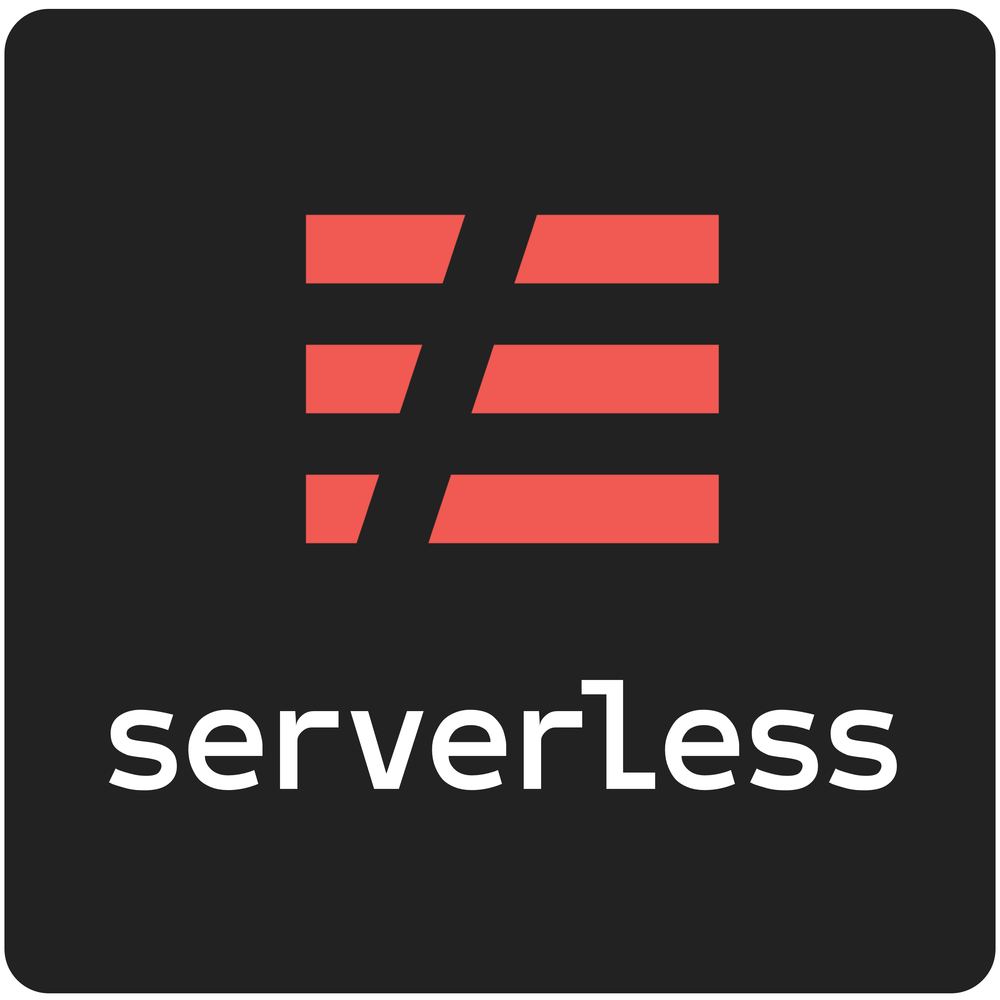

<div id="top"></div>

[![MIT License][license-shield]][license-url]
[![LinkedIn][linkedin-shield]][linkedin-url]


<!-- PROJECT LOGO -->
<br />
<div align="center">
  <a href="https://github.com/PaulosSouza/todos-serverless">
    
  </a>

<h3 align="center">Todos Serverless</h3>

  <p align="center">
    A To do project using serverless framework wrote with NodeJS/Typescript
    <br />
    <a href="https://github.com/PaulosSouza/todos-serverless"><strong>Explore the docs »</strong></a>
  </p>
</div>


<!-- ABOUT THE PROJECT -->
## About The Project

To-do serverless is a simple project that the main purpose is to study serverless framework and its environment. This application has two routes, one for creating a to-do and another for getting to-dos already created.
<br><br>

### Built With

* [Typescript](https://www.typescriptlang.org/)
* [Serverless](https://www.serverless.com/)
* [Dynamodb](https://aws.amazon.com/pt/dynamodb/getting-started/)
<br><br>


## How to
### Warm up
This project uses serverless framework which means you must install with the global flag into your computer.
* npm
  ```sh
  npm install serverless -g
  ```
* yarn
  ```sh
  yarn global add serverless
  ```

### Install

1. Clone the repo
   ```sh
   git clone https://github.com/PaulosSouza/todos-serverless.git
   ```
2. Install NPM packages with npm or yarn
   ```sh
   npm install
   ```
   ```sh
   yarn
   ```
3. Install dynamodb packages (you must have JDK installed)
   ```sh
   npm run dynamodb:install
   ```
   ```sh
   yarn run dynamodb:install
   ```
### Run
1. To-do serverless uses serverless-offline and dynamodb-local plugin, because of that you should run dynamodb command first to create the tables. After that you should keep running because dynamo it'll listen on port 8080 all requests to it, in that case create and get to-dos.
    ```sh
   npm run dynamodb:start
    ```
    ```sh
   yarn run dynamodb:start
    ```

2. Leaving Dynamodb command running, you will be able to run a dev command which will start a lambda locally listening on port 3000 waiting for two requests, one for creating a new to-do and another to fetch all to-dos.
    ```sh
    npm run dev
    ```
    ```sh
    yarn run dev
    ```
<br>


<!-- LICENSE -->
## License

Distributed under the MIT License. See `LICENSE.txt` for more information.
<br><br>

<!-- CONTACT -->
## Contact

Project Link: [https://github.com/PaulosSouza/todos-serverless](https://github.com/PaulosSouza/todos-serverless)
<br><br>


[license-shield]: https://img.shields.io/github/license/PaulosSouza/todos-serverless.svg?style=for-the-badge
[license-url]: https://github.com/PaulosSouza/todos-serverless/blob/master/LICENSE.txt
[linkedin-shield]: https://img.shields.io/badge/-LinkedIn-black.svg?style=for-the-badge&logo=linkedin&colorB=555
[linkedin-url]: https://linkedin.com/in/paulo-henrique-89b148166
